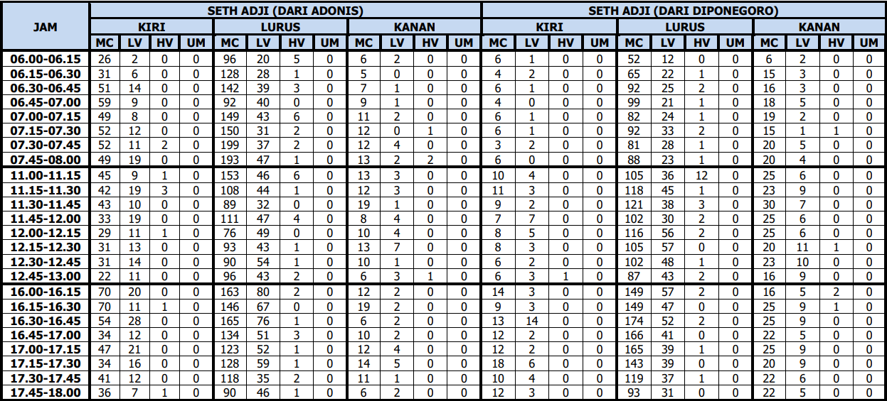
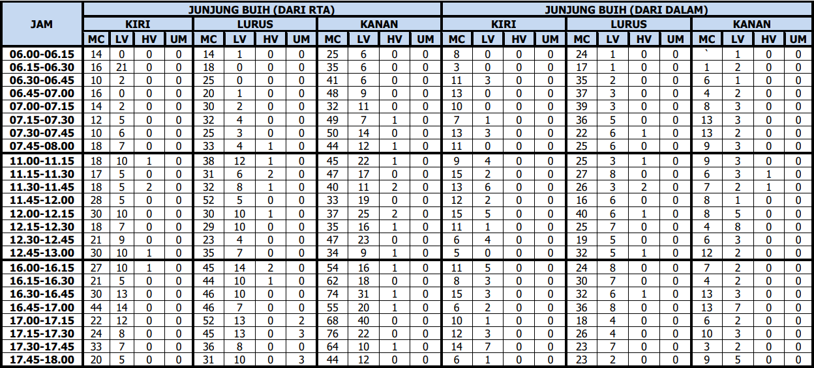
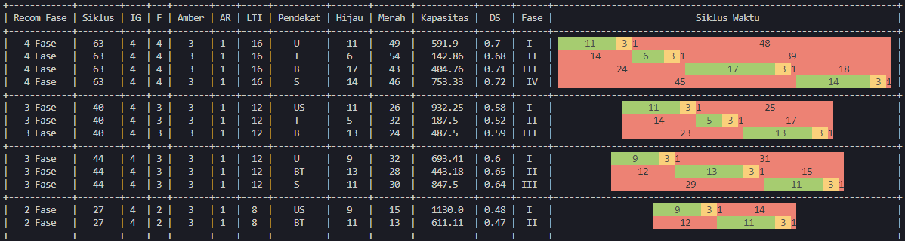

# Traffic Light Cycle Time Generator

Alat untuk menampilkan rekomendasi pengaturan lampu lalu lintas menurut
banyakknya kendaraan yang melintasi di persimpangan

# Enviroment Setup

- Sistem Operasi Windows/Linux/MacOS
- [Python3](https://www.python.org/downloads/)
- [Pip](https://pip.pypa.io/en/stable/installation/)
- Nodepad/Visual Studio Code
- [Git](https://git-scm.com/downloads) \*opsional

## Project Setup

Jalankan perintah ini di terminal untuk mengcloning repository ke lokal jika
sebelumnya telah menginstall [Git](https://git-scm.com/downloads)

```bash
git clone https://github.com/jrdrwn/traffic-light-cycle-time-generator.git
```

Masuk ke direktori

```bash
cd traffic-light-cycle-time-generator
```

Jika belum menginstall git bisa mengunduh arsip project di link berikut

[https://github.com/jrdrwn/traffic-light-cycle-time-generator/archive/refs/heads/main.zip](https://github.com/jrdrwn/traffic-light-cycle-time-generator/archive/refs/heads/main.zip)

kemudian extract dan buka direktori project

> RECOMMENDED:
> [Setup Virtual Enviroment](https://docs.python.org/3/library/venv.html)

Jalankan perintah ini di terminal untuk menginstall library yang dibutuhkan

```bash
pip3 install -r requirements.txt
# atau jika error
pip install -r requirements.txt
```

# Traffic Light Data Setup

Alat ini memerlukan data jumlah kendaraan yang melintasi persimpangan untuk
menghasilkan rekomendasi pengaturan lampu lalu lintas. Data ini bisa didapatkan
dari hasil pengamatan langsung di lapangan atau menggunakan data yang telah ada.

## Manual

Contoh data simpang 4 yang didapat dari hasil pengamatan langsung di lapangan

 

Masukkan data tersebut dengan format sesuai dengan simpang dan arahnya sebagai
berikut

```json
[
  {
    "jenis": "mc",
    "data": [6, 4, 6, 4, ...]
  },
  {
    "jenis": "lv",
    "data": [...]
  },
  {
    "jenis": "hv",
    "data": [...]
  },
  {
    "jenis": "um",
    "data": [...]
  }
]
```

letakkan nilai diatas ke

```json
{
  "arah": "DARI ARAH MANA?",
  "tipe": "utama B | utama A | minor A | minor B",
  "lebar_lajur": 0.00,
  "pendekat": "U | T | B | S",
  "median": null | 0.00,
  "ke": {
    "kiri": [LETAKKAN DISINI],
    "kanan": [LETAKKAN DISINI],
    "lurus": [LETAKKAN DISINI]
  }
}
```

terakhir masukkan data semua arah simpang

```json
[
  {
    "arah": ...,
    "tipe": ...,
    "lebar_lajur": ...,
    "pendekat": ...,
    "median": ...,
    "ke": ...
  },
  {...},
  {...},
  {...}
]
```

berikan nama file tersebut dengan format `.json` dan letakkan di direktori utama

> contoh: `simpang-4.json`

contoh data simpang 4 bisa dilihat di [data.json](data.json) dan untuk simpang 3
di [data_simpang_3.json](data_simpang_3.json.json)

## Automatic

Coming Soon

# Run Project

Jalankan perintah ini di terminal untuk menjalankan project

```bash
python3 main.py <nama_file.json>
# atau jika error
python main.py <nama_file.json>
```

Contoh hasil rekomendasi pengaturan lampu lalu lintas akan muncul di terminal



# References

- [MKJI 1997 - Manual Kapasitas Jalan Indonesia](./ref/mkji.pdf)
- Folder [ref](./ref)

# License

[MIT](./LICENSE)
